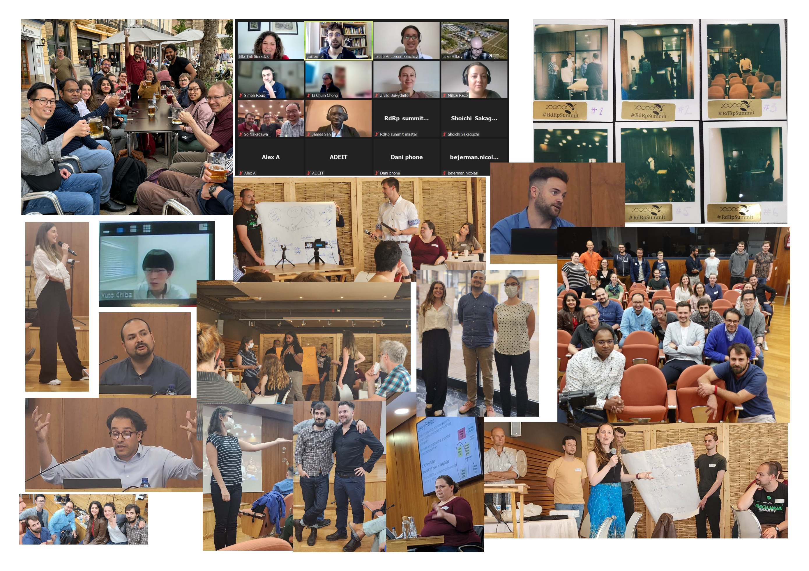

# Breaking Eco Chambers

<!-- more -->

!!! warning
    This is not a scientific piece, just some ramblings I'm writing to pass the time waiting for a flight layover.  

I remembe in my undergrad lessons, a professor had us read ["The Structure of Scientific Revolutions" by Thomas Kuhn](https://en.wikipedia.org/wiki/The_Structure_of_Scientific_Revolutions). Being the lazy student I was, I half read half audio-booked it. At the time, I thought it was a lot of philosophical ... <i>verbosity</i> ... , and like many other wide-eyed students, I saw myself as a future disrupter and revolutionary rather than a scientist during a time of "normal science", doing cumulative work. 
Fast forward a few years, now a PhD student, less illusions, more reality, and way less lazy - spending most of my waking time coding, thinking, and exploring ideas about in-silico virus discovery. Not great from a work-life balance perspective, but that's for another post. I've thought a project I led  was going to be dustruptive, breaking a cycle of noraml science. Then a few other research endevours were published or pre-printed, and one of the highlights of my own work was crowned to some of these other projects. As part of being second or third to the punch, reviewers rightfully requested that we revise our manuscript to to include a comparison to these other projects. This scary task fell on me and a few other co-authors, and we were able to deliver a revised manuscript in a few weeks. My first first-author paper ends with a very mature 'limtations' section, that (tl;dr) identifies very little actual overlap between the projects in terms of qualitative results. The paper was accepted, the work was published, and <i>(eventually)</i> PhD awarded.  
Having trying to do an honest comparison between projects, I realized none of the projects was truly completly disruptive (despite them all having peofund and some even lasting effects on the field). And projects relied on <b>existing</b>-yet-different datasets, methods workflows and even terminologies. While some overlap existed, essentially all projects were re-inventing certain parts of the same feild. <b>Divergence</b>. Not neccesarily a bad thing, but for comparison sake, and for sake of being able to robustly use each other's work, this was a problem. We essentially needed to convert each work's results to the system of each other's work just to get basic numbers. Or not, and risk doing an inacurate comparison...  
In terms of staticstics, imagine you need to work with three sets of definitions for: false/true positives, and flase/true negatives. 
Alternatively, you could assign everything every project identified as a virus as part of the positive set, and maybe calculate recall as detection rate out of the total positives, per project.
Another thing I noticed was this problem was not unique to RNA virus discovery, and even in this field it wasn't new. In specific terms, an example is the use of votu as a metric (and variations of it, like different %ANI or %AAI cutoffs) versus more tree-derived metrics like species, genus, family, order, etc. 
On top of that, the minimal reliable unit of a virus was not consistent, nor the definition of what constituted a novel one.
This led to some confusion, miscommunications, and even some eventual drama and mis/over interpretations by some projects. It doesn't help that the existing systems for classifying viruses are ... not perfect ... and even worse, haven't really caught up with the new rate of virus discovery (yes I know about the consensus statement regarding metagenomic sequences, not it hasn't made much effect at the time).  
Another thing - with all respect to priority claims and number comparisons - as the "good cop" from my phd committee once said - "so you found a bunch of viruses, and ?" 
The big numbers game is nice and all, but is kinda devoid of any biological meaning. Hence the "qualitative" difference in the results. What can we actually (reliably) say about these viruses?...
Spoiler: not much. And it takes a lot of work. For those very similar to known ones, we can extrapolate some properties, under certain assumptions -altough those should be made explicit, like 'members of x family are all homogenously exclusive this/or/that property' where property is a trait of interest, like:
* genome polarity [+/-ss/ds], 
* capsid geometry [helical,flexiable, ico/polyhedral/other or un-encapsidated], 
* membrane/envelope/no membrane, 
* mono/poly partite, 
* and... host range!
Any way, I digress. Back to the current story...

As soon as I could, I reached out to the leads of some other projects, not suprisingly, they were also frustrated. We hatched a plan. To get a conversation starting, out in the open, and to make the field better.  
Then, we got more and more people involved. A theme began to emerge - instead of relying on the PIs (some of which have a long history of ... non-coporation...), we contated the PhD students and postdocs directly, and we didn't just invite them to a single event or to attend, we invited them to join us in orgnaising an event that kind of led to creating a community.  
There were many obvious obstacles:
* Time
* Money
* Location   
And less obvious ones: most of us have existing obligations and research to do, and this required a lot of coordination and time investment.

But we got over the hurdles. We got some funding. We got people talking. New collaborations were formed, ideas were shared, and some good science was done (and some beers were had). It is probably not enough, but it was a start. That was 2 years ago, and I have amazing memories of the event and the people in it and those who co-organised it. They all did an incredible job, and I'm proud to be part of the community they created.  

I think the effect had quantifiable effects. In my PhD I looked at co-authorship and co-citation networks, and some obvious clusters of collaboration emerge. I considered these to be "eco-chambers" - groups of people who are connected to each other, and use a similar chain of logic and methods. The hubs in the network revolved around the PIs, with a lot of alums and postdocs around them, but not much (or any) connecting these hubs. I'm intentionally not placing this network plot here - it's in my thesis, if you want go find it. I don't see this as any specific fault of anyone. I do know that the summit helped break these chambers, and I'm proud of that. Tying it back to the "Scientific Method" and Kuhn, I now think the event and the community formed were more of a disruptive step in this field any specific study or paper. I'm obviously not objective, and I'm probaly a bit naive and over-extrapolating the effects of the it.   
We just held the second summit, and it was great. It's also amazing to see the personal and professional growth of some community members, along how new members have joined the community and stepped up to help. I was less involved in the organisation this time, credit for that should go the entire organising committee (here is the subset of in-person committee members):  

  

I'm already looking forward to the next time, or to whatever shape and form the community takes on - it might be less of a one-time-big-event, or have additional smaller-more hands on events [personal preference, we'll see], and there are some initatives for more rolling projects, like routine journal clubs.

Anyway, here's the (on-site) group photo from the second summit. I'm not in it - I was sure we forgot someone and went searching for only to become that person
  