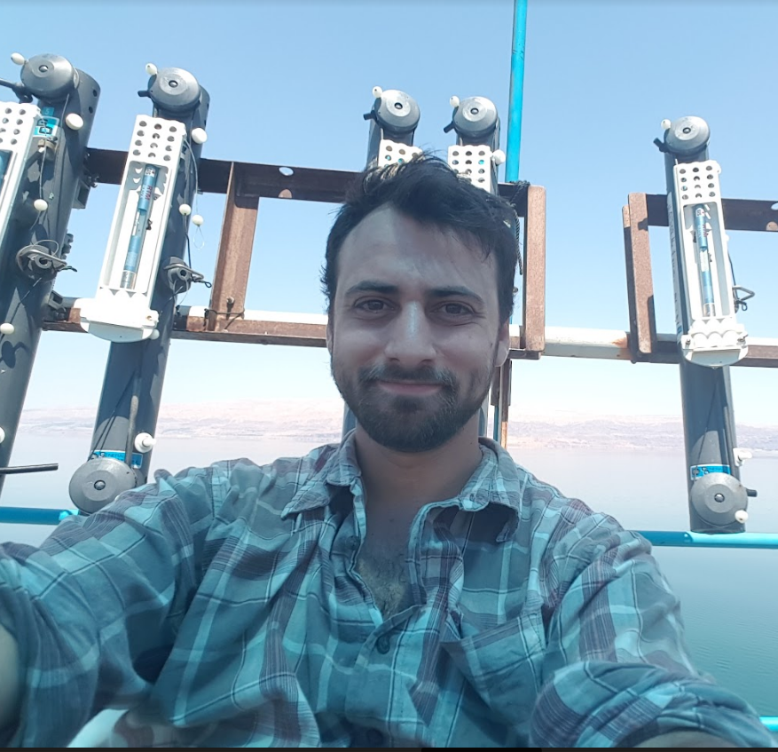
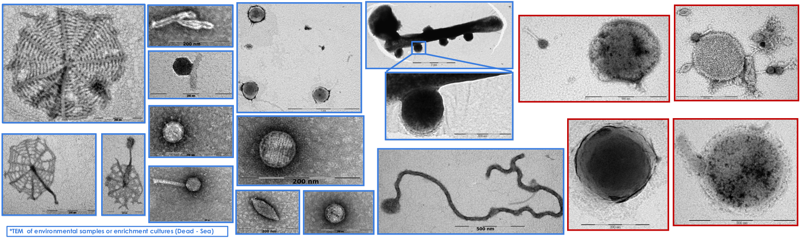
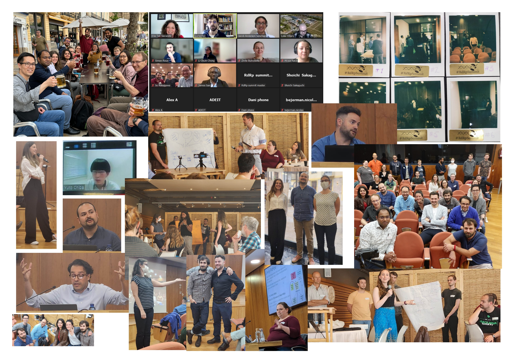

#

{ align=left width="350"  }

## About
I am a "wet lab turned computational biologist" studying microbial parasites (mostly RNA viruses, but interested in microeukaryotic parasites (and their viruses too)).
Recently (2025) started a postdoc research position at the Joint Genome Institute, as part of Simon Roux's Viral Genomics Group.  
My main project is [RolyPoly](https://code.jgi.doe.gov/rolypoly/rolypoly), a swiss-army knife toolkit for RNA virus discovery and characterization.  
 It has 2 main goals:   
<b>-</b> Make life easier for non-computational researchers who want to dive into their data.  
<b>-</b> Help developers of virus analysis pipeline "plug" holes missing from their framework, by using specific RolyPoly commands to easily add features to their existing code base (regardless of type - next-flow, snakmake, CLI or as directly importing functions other pipeline), like library detection and subsampling, read-filtering, genome annotation(functional and identifying RNA strucutres) or stacking results from different tools. It is an open (still in progress) project, but I hope to open it up soon.  
In between wrangling viral genomes and benchmarking other people's tools, I have a habit of writing misc quality-of-life [scripts](software.md) that solve very specific problems exactly once.  I also suffer from over-engineering and premature optimision of tasks ("how fast can we make this gff/fasta parser?..." and "what if we used a modern format?").

[:fontawesome-brands-github: GitHub](https://github.com/urineri){ .md-button .md-button--primary }
[:fontawesome-brands-twitter: Twitter](https://x.com/UriNeri2){ .md-button .md-button--primary }
[:simple-bluesky: Bluesky](https://bsky.app/profile/urineri.bsky.social){ .md-button .md-button--primary }
[:fontawesome-brands-google: Scholar](https://scholar.google.com/citations?hl=en&user=VComRgYAAAAJ){ .md-button .md-button--primary }

## Focus and Interests

### RNA Viruses & Characterisation
I once presented results from my PhD committee suggesting we found a bunch of novel viruses, and I'll never forget my "good cop" commitee member's comment: 
>"And? So you found a lot of viruses, so what?" 

And she was right. Simply identfying a sequence as viral is just the first step of the story. 
Taken her comment to heart, a large part of my work is and has been focused on characterising uncultivated viruses. So many things remain unknown:  
- What is the genome topology and structure? (RNA/DNA, single-stranded, double-stranded, linear/circular)  
- What is the capsid structure? does it even have a capsid?  
- Is the pathogenic?  
- What is the role of the virus in its environment?  
- What is the host range?!  

### Hypersaline Environments
The Dead Sea has a special place in my heart, where my research journey started. I've had the privilege of sampling and processing genetic material from its water column, searching for novel archaea and viruses which led to the cultivation of novel archaea and the assembly of a complete nanohaloarchaeal genome (which I'm still proud of, it's one circular contig from a 0.2um filter, no binning no nothing). While we didn't find any RNA viruses there, I'm still hopeful one day we find the holy grail - a true archaeal RNA virus...  

{ align=center width=150% }

### Community
In 2023, I helped organize the first RdRp Summit, bringing together early-career researchers from around the world to improve RNA virus discovery methods. It was a great experience, and a refereshing wave of actual idea sharing, in a niche that has too much "I'm the best" and not enough "let's make this better" (you can probably quantify this if looking at a citation graph). The community has grown since then, and I'm looking forward to the next summit.
{ align=center width=150% }

## Code
My GitHub is home to a growing collection of bioinformatics tools (mostly forks cause I didn't like some very non-important bits) and quality-of-life scripts.

 